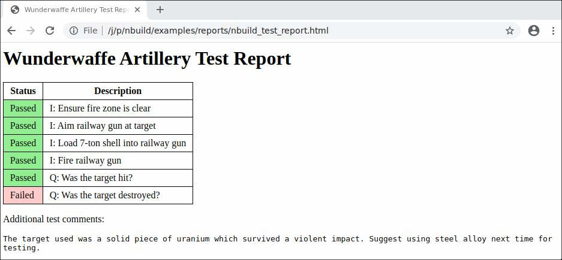

# Navy Build

`nbuild` is a library providing the following capabilities:

 - Describe a software project from artifacts (source or binary redistributables) to artifacts (usually programs as `.exe` files)
 - Using these descriptions of the project test and report the following:
    - Correctness
    - Completeness
 - Finally using the software project description and the tests, produce a formal documentation
   describing how to use each tested capability.

This directory holds the `nbuild/` source directory as well as an `examples/` directory showing
how one might use `nbuild` to generate reports about projects.

# Example Processes

## Process 01

1. A tester uses the `nbuild` library to write `review_proj01.py`,
   which is a formal description of the project deliverables and what the deliverables must do.

2. A contractor submits a project as source code on a USB drive. The code resides in a folder "proj01".

3. The tester runs `python review_proj01.py` and their browser opens to the following report:


## Process 02

1. A tester uses the `nbuild` library to write `review_nasa_worldwind.py`,
   which is a formal description of a [public mapping library written by NASA](https://worldwind.arc.nasa.gov/).

2. The tester runs `python review_nasa_worldwind.py` and their browser opens to the following report:
  


## Process 03

1. A tester uses the `nbuild` library to describe a physical process for testing
   a new artillery loading mechanism in `review_artillery_loading.py`. This requires a person to perform the tests
   and `nbuild` will issue instructions textually. The person doing
   the test will respond to simple "yes or no" questions.

2. The tester runs `python review_artillery_loading.py` and follows the instructions given.
   When completed a report like the following will be generated:
  



# Plans

 - [ ] Self-service HTTP server (upload `.exe` files, get reports back)
 - [ ] Record runtime
 - [ ] Predict runtime 
 - [ ] Support Maven builds (java)
 - [ ] Support Gradle builds (java)
 - [ ] Support DotNet builds (C\#)

# Project Hygiene

Run `python do_quality_checks.py` to check the `nbuild` library code quality.

Pass your favorite editor (`subl3` for Sublime 3, `idea` for the IntelliJ IDE)
to the command to have it open at the first line that failed the linter:

```bash
python do_quality_checks.py edit-with subl3
```


